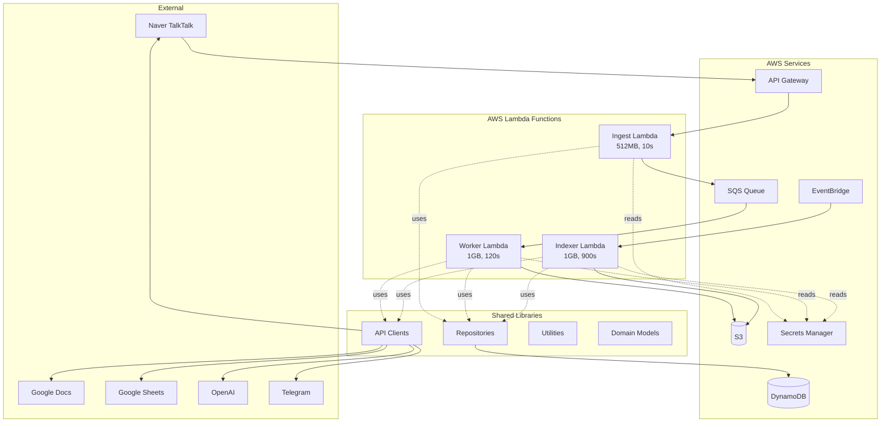
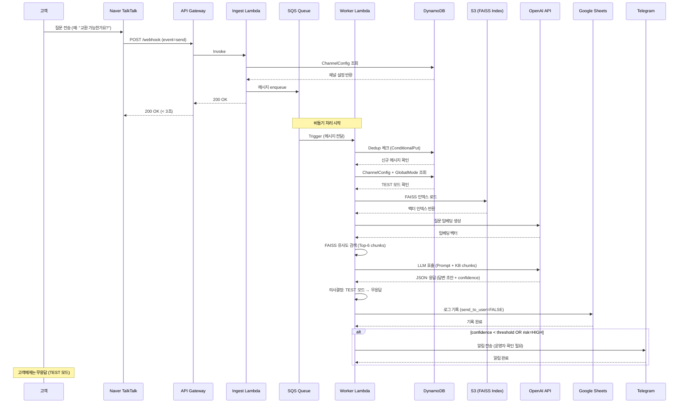
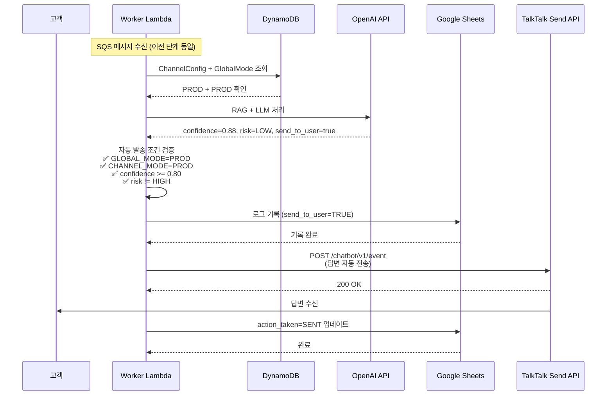
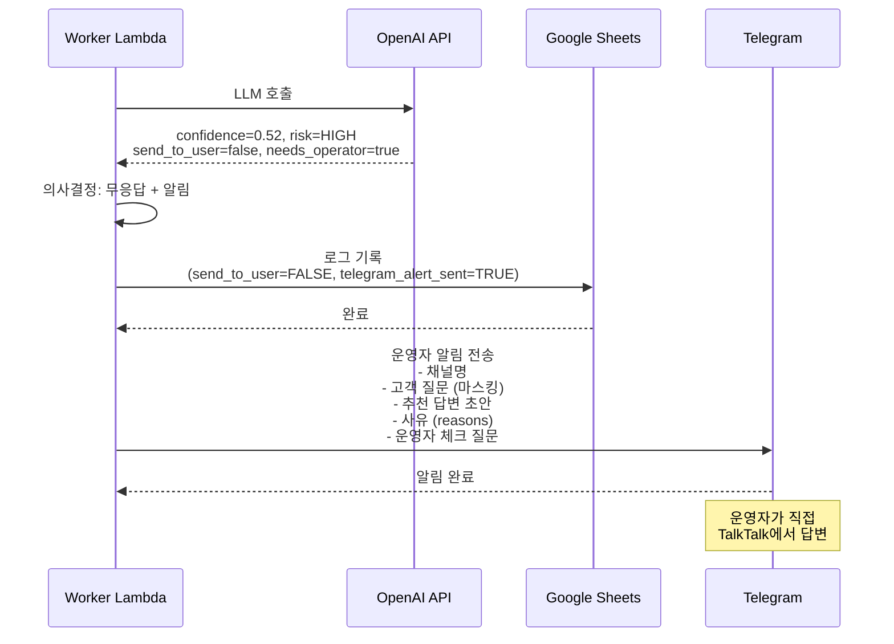
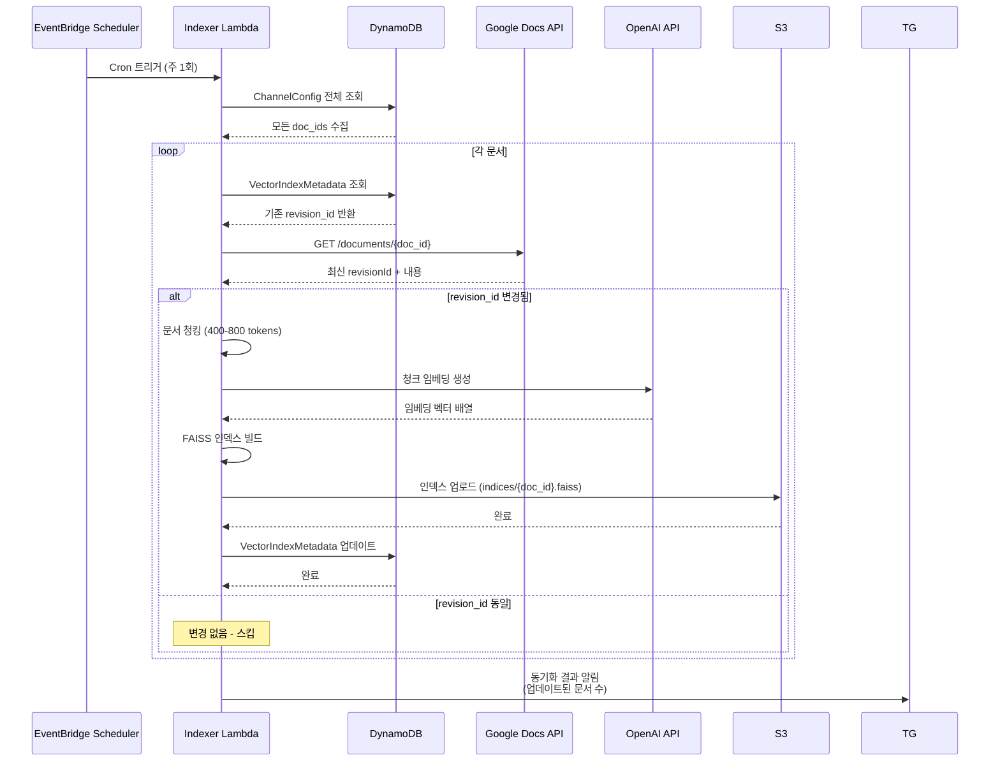

# TalkTalk Auto Architecture Document

## Introduction

This document outlines the overall project architecture for **TalkTalk Auto** (네이버 톡톡 문의 응답 자동화), including backend systems, shared services, and non-UI specific concerns. Its primary goal is to serve as the guiding architectural blueprint for AI-driven development, ensuring consistency and adherence to chosen patterns and technologies.

**Relationship to Frontend Architecture:**
This project is primarily backend-focused (serverless AWS architecture with API integrations). No separate frontend architecture is required as this system operates as a webhook-based automation service.

### Starter Template or Existing Project

**Decision:** Greenfield project - no starter template.

This is a completely new architecture built from scratch. Manual setup will be required for all tooling and configuration, optimized for AWS serverless deployment.

### Change Log

| Date | Version | Description | Author |
|------|---------|-------------|--------|
| 2025-12-19 | 1.0 | Initial architecture document | Winston (Architect) |

---

## Customer Communication Policies

**CRITICAL: These policies are non-negotiable and must be enforced at all levels of the system.**

### Core Principles

The TalkTalk Auto system prioritizes **customer trust and safety** above all else. The system must NEVER provide uncertain, speculative, or incomplete information to customers. When in doubt, the system remains silent and alerts operators.

### Prohibited Response Patterns

The following response patterns are **STRICTLY FORBIDDEN** in all customer-facing communications:

❌ **"I don't know" responses:**
- "모르겠습니다" (I don't know)
- "잘 모르겠어요" (I'm not sure)
- "확실하지 않습니다" (I'm not certain)

❌ **Ambiguity acknowledgments:**
- "애매합니다" (It's ambiguous)
- "명확하지 않습니다" (It's not clear)
- "정확하지 않을 수 있습니다" (It might not be accurate)

❌ **Speculation indicators:**
- "추측입니다" (This is a guess)
- "아마도" (Maybe/Perhaps)
- "~인 것 같습니다" (It seems like...)

❌ **Agent transfer messages:**
- "상담원에게 연결할게요" (I'll connect you to an agent)
- "담당자에게 문의해주세요" (Please contact the person in charge)
- "상담원 연결" (Agent transfer)

### Handling Uncertain Cases

When the system encounters ambiguous questions, low-confidence responses, or edge cases outside the knowledge base:

**Customer-facing action:**
- ✅ **NO RESPONSE** (silent/no-reply)
- ❌ DO NOT send any message acknowledging the question
- ❌ DO NOT send apology messages
- ❌ DO NOT send "please wait" messages

**Operator-facing action:**
- ✅ **Immediate Telegram alert** with the following information:
  - Channel name (e.g., "wc123456")
  - Customer ID (masked for privacy: first 2 + last 2 characters only)
  - Timestamp (KST)
  - Question summary
  - Draft response (if LLM generated one)
  - Reason for flagging (e.g., "Low confidence score: 0.42", "No relevant KB chunks found")
  - Link to Google Sheets log entry

### Telegram Alert Triggers

Telegram alerts to operators are triggered in the following scenarios:

1. **Low LLM Confidence:**
   - LLM confidence score < threshold (defined in ChannelConfig)
   - LLM explicitly flags `send_to_user: false`

2. **Knowledge Base Gaps:**
   - No relevant KB chunks found (RAG similarity score too low)
   - Question topic outside documented scope

3. **Risk Indicators:**
   - LLM identifies high risk level (`risk_level: HIGH` or `risk_level: MEDIUM`)
   - Question contains sensitive keywords (payment, refund, legal, medical)

4. **System Errors:**
   - RAG pipeline failure
   - LLM API timeout or error
   - Deduplication failure (potential infinite loop)

5. **TEST Mode Override:**
   - Any message received in TEST mode (for verification purposes)

### TEST vs PROD Mode Behavior

**TEST Mode (default):**
- ALL messages trigger no-response + Telegram alert
- ALL messages logged to Google Sheets
- NO automatic sends to customers under ANY circumstances
- Purpose: Validation and training phase

**PROD Mode (three-gate system):**
- Gate 1: Global Mode = PROD (DynamoDB GlobalMode table)
- Gate 2: Channel Mode = PROD (DynamoDB ChannelConfig table)
- Gate 3: LLM Approval = `send_to_user: true` (runtime decision)

**ONLY if all three gates pass:** Send response to customer

**If any gate fails:** No-response + Telegram alert + Sheets log

### Privacy and Masking Requirements

When logging or alerting, the following PII must be masked:

- **Phone numbers:** Show only first 3 + last 2 digits (010-1234-5678 → 010-**-**78)
- **Email addresses:** Show only first 2 + domain (user@example.com → us***@example.com)
- **Customer IDs:** Show only first 2 + last 2 characters (abcdef123456 → ab******56)
- **Payment information:** NEVER log or transmit (block entirely)

All masking is handled by the `masking.py` utility module.

### Enforcement Mechanisms

**Design-level enforcement:**
- Worker Lambda decision logic enforces three-gate system
- LLM system prompt explicitly prohibits uncertain language
- Response validation layer checks for prohibited patterns before sending

**Testing requirements:**
- Unit tests must cover all prohibited response patterns
- Integration tests must verify no-response behavior in edge cases
- E2E tests in TEST mode must confirm no actual sends occur

**Monitoring:**
- CloudWatch metrics track send_to_user=false rate
- Telegram alerts provide audit trail
- Google Sheets logs enable post-hoc analysis

---

## TEST/PROD Mode Framework

The TalkTalk Auto system operates in a **dual-mode architecture** with TEST as the default safe mode and PROD requiring explicit multi-gate approval. This framework prevents accidental automated sending while enabling gradual rollout across 16 channels.

### Mode Hierarchy and Control

**Three-Level Control System:**

```
Level 1: Global Mode (DynamoDB GlobalMode table)
   ↓ AND
Level 2: Channel Mode (DynamoDB ChannelConfig per channel)
   ↓ AND
Level 3: LLM Decision (Runtime confidence + risk assessment)
   ↓
Final Decision: Send or No-Send
```

**ALL three levels must approve for automated sending to occur.**

### TEST Mode (Default)

**Purpose:** Safe validation and training phase before production deployment.

**Behavior:**
- ✅ Receive all customer messages
- ✅ Process through full RAG + LLM pipeline
- ✅ Log all messages to Google Sheets (question + draft response)
- ✅ Send Telegram alerts for ALL messages (for operator review)
- ❌ **NEVER send responses to customers** (regardless of confidence score)

**Use Cases:**
1. Initial system deployment and testing
2. New channel onboarding
3. Knowledge base updates validation
4. LLM prompt tuning
5. Emergency killswitch (revert PROD → TEST if issues detected)

**Configuration:**
```yaml
GlobalMode:
  config_key: "GLOBAL_MODE"
  mode: "TEST"  # Default

ChannelConfig (per channel):
  channel_id: "wc123456"
  channel_mode: "TEST"  # Default for new channels
  enabled: true
```

**TEST Mode Decision Flow:**
```
Customer Message
  → Ingest Lambda (200 OK)
  → Worker Lambda
  → Check GlobalMode = TEST?
     YES → Skip send, log to Sheets, alert to Telegram
     (Even if channel_mode=PROD and LLM confidence=0.95)
```

### PROD Mode (Three-Gate System)

**Purpose:** Controlled automated customer response after validation.

**Three Gates (ALL must pass):**

**Gate 1: Global Mode = PROD**
- DynamoDB GlobalMode table: `mode = "PROD"`
- Master killswitch controlled by system administrator
- Single global value affects all channels

**Gate 2: Channel Mode = PROD**
- DynamoDB ChannelConfig table: `channel_mode = "PROD"`
- Per-channel control enables gradual rollout
- Allows testing one channel while others remain in TEST

**Gate 3: LLM Approval**
- Runtime decision by Worker Lambda based on:
  - `confidence_score >= channel.confidence_threshold` (default: 0.80)
  - `risk_level != "HIGH"` (LLM-assessed risk)
  - `send_to_user = true` (LLM explicit approval flag)

**PROD Mode Decision Flow:**
```
Customer Message
  → Ingest Lambda (200 OK)
  → Worker Lambda
  → Gate 1: GlobalMode = PROD?
     NO → Skip send, log, alert
     YES → Continue to Gate 2
  → Gate 2: channel_mode = PROD?
     NO → Skip send, log, alert
     YES → Continue to Gate 3
  → Gate 3: LLM approves? (confidence >= threshold AND risk != HIGH)
     NO → Skip send, log, alert (reason: low confidence / high risk)
     YES → Send response to customer + log + no alert
```

**PROD Mode Behavior:**
- ✅ Automated sending ONLY if all three gates pass
- ✅ Log all messages to Google Sheets
- ✅ Telegram alert ONLY for:
  - Low confidence cases (gate 3 failed)
  - High risk cases (gate 3 failed)
  - System errors
- ❌ No Telegram alert for successfully sent messages (reduces noise)

**Configuration Example:**
```yaml
GlobalMode:
  config_key: "GLOBAL_MODE"
  mode: "PROD"  # Manually set after testing

ChannelConfig (gradual rollout):
  - channel_id: "wc_pilot_channel"
    channel_mode: "PROD"  # First production channel
    confidence_threshold: 0.85  # Higher threshold for safety

  - channel_id: "wc_beta_channel"
    channel_mode: "TEST"  # Still testing

  - channel_id: "wc_main_channel"
    channel_mode: "DISABLED"  # Temporarily disabled
```

### Channel Routing Pattern

**Webhook URL Design:**

Each of the 16 channels has a unique webhook URL with embedded `channel_id`:

```
https://api.example.com/naver/talktalk/{channel_id}/webhook

Examples:
  https://api.example.com/naver/talktalk/wc123456/webhook
  https://api.example.com/naver/talktalk/wc789012/webhook
```

**Why URL-based routing:**
- Naver TalkTalk allows registering unique webhook URL per channel
- No need for separate authentication per channel (URL itself identifies channel)
- Simplifies Ingest Lambda logic (channel_id from path parameter)

**Ingest Lambda Channel Routing:**

```python
def lambda_handler(event, context):
    # Extract channel_id from API Gateway path parameters
    channel_id = event["pathParameters"]["channel_id"]

    # Load channel-specific configuration
    channel_config = channel_config_repo.get(channel_id)

    if not channel_config or not channel_config["enabled"]:
        return {"statusCode": 404, "body": "Channel not found or disabled"}

    # Enqueue message with channel context
    sqs_client.send_message(
        QueueUrl=QUEUE_URL,
        MessageBody=json.dumps({
            "channel_id": channel_id,
            "webhook_event": event["body"],
            "timestamp": datetime.utcnow().isoformat()
        })
    )

    return {"statusCode": 200, "body": "OK"}
```

### Mode Transition Strategy

**TEST → PROD Transition (Per Channel):**

1. **Prerequisites:**
   - Channel in TEST mode for at least 7 days
   - Minimum 20 test messages processed
   - Manual review of Google Sheets logs shows acceptable quality
   - No critical errors in CloudWatch Logs
   - Knowledge base is up-to-date

2. **Gradual Rollout:**
   - Week 1: Enable 1-2 pilot channels (low volume)
   - Week 2-3: Monitor Sheets logs and Telegram alerts
   - Week 4: Enable next 3-5 channels if no issues
   - Week 5+: Roll out remaining channels

3. **Safety Measures:**
   - Keep GlobalMode = TEST until at least 3 channels proven stable
   - Monitor send_to_user=false rate (should be < 30%)
   - Set higher confidence_threshold initially (0.85-0.90 vs default 0.80)

**Emergency PROD → TEST Rollback:**

If issues detected (e.g., inappropriate responses, high false positive rate):

1. **Immediate:** Set GlobalMode = TEST (affects all channels instantly)
2. **Per-channel:** Set problematic channel_mode = TEST
3. **Investigation:** Review Sheets logs, adjust prompts/KB, re-test
4. **Gradual re-enable:** Follow TEST → PROD process again

### Decision Logic Implementation

**Worker Lambda Pseudo-code:**

```python
def make_send_decision(channel_config, global_mode, llm_response):
    # Gate 1: Global Mode
    if global_mode != "PROD":
        return {
            "send_to_user": False,
            "reason": "GLOBAL_MODE_TEST",
            "action": "LOG_AND_ALERT"
        }

    # Gate 2: Channel Mode
    if channel_config["channel_mode"] != "PROD":
        return {
            "send_to_user": False,
            "reason": f"CHANNEL_MODE_{channel_config['channel_mode']}",
            "action": "LOG_AND_ALERT"
        }

    # Gate 3: LLM Approval
    if llm_response["risk_level"] == "HIGH":
        return {
            "send_to_user": False,
            "reason": "HIGH_RISK",
            "action": "LOG_AND_ALERT"
        }

    if llm_response["confidence"] < channel_config["confidence_threshold"]:
        return {
            "send_to_user": False,
            "reason": f"LOW_CONFIDENCE_{llm_response['confidence']:.2f}",
            "action": "LOG_AND_ALERT"
        }

    if not llm_response.get("send_to_user", False):
        return {
            "send_to_user": False,
            "reason": "LLM_DECLINED",
            "action": "LOG_AND_ALERT"
        }

    # All gates passed
    return {
        "send_to_user": True,
        "reason": "ALL_GATES_PASSED",
        "action": "SEND_LOG_NO_ALERT"
    }
```

### Monitoring and Observability

**CloudWatch Metrics:**
- `SendDecision.GlobalModeTest` (count)
- `SendDecision.ChannelModeTest` (count)
- `SendDecision.LowConfidence` (count)
- `SendDecision.HighRisk` (count)
- `SendDecision.Sent` (count)
- `SendDecision.NoSendRate` (percentage)

**Alerting Thresholds:**
- `SendDecision.NoSendRate > 80%` for 6 hours → Telegram alert (possible KB gap)
- `SendDecision.HighRisk > 5%` → Immediate review required
- `SendDecision.Sent = 0` for 24 hours in PROD mode → Possible configuration issue

**Google Sheets Audit Trail:**

Every message logged with:
- `global_mode`: TEST or PROD
- `channel_mode`: TEST, PROD, or DISABLED
- `llm_confidence`: 0.00-1.00
- `risk_level`: LOW, MEDIUM, HIGH
- `send_decision`: SENT, NO_SEND_TEST_MODE, NO_SEND_LOW_CONFIDENCE, etc.
- `alert_sent`: true/false

---

## High Level Architecture

### Technical Summary

TalkTalk Auto employs an **ultra-low-cost serverless architecture** on AWS optimized for **10-30 messages/day** across 16 channels. The system receives webhook events from Naver TalkTalk channels, processes them asynchronously through a RAG pipeline using Google Docs as the knowledge base and OpenAI GPT-4o-mini for response generation, and operates in dual modes (TEST/PROD) with safety-first principles.

**Cost Optimization Focus:** At this volume (~300-900 messages/month), all AWS services operate in free tier or near-zero cost ranges. Lambda invocations (~90-270/month), DynamoDB requests (on-demand), SQS messages, and S3 storage all cost <$5/month combined. The primary recurring cost is OpenAI API usage (~$0.50-1.50/month for gpt-4o-mini).

This architecture prioritizes **extreme cost efficiency over speed** - processing latency of 30-120 seconds is acceptable, allowing minimum Lambda memory allocation (512MB) and cold starts without performance concerns.

### High Level Overview

**Architectural Style:** Serverless Event-Driven Architecture

**Repository Structure:** Monorepo (single repository with organized Lambda functions and shared libraries)

**Service Architecture:** Function-per-Purpose Serverless
- Ingest Function: Webhook validation and SQS enqueueing
- Worker Function: RAG + LLM + orchestration
- Indexer Function: Scheduled Google Docs synchronization and vector index updates

**Primary Data Flow:**
1. **Ingestion**: Naver TalkTalk webhook → API Gateway → Lambda (Ingest) → SQS → immediate 200 OK (< 3s)
2. **Processing**: SQS trigger → Lambda (Worker) → RAG retrieval → OpenAI API → response generation
3. **Decision**: Confidence scoring → TEST mode (log only) or PROD mode (conditional send)
4. **Audit**: Google Sheets append for all processed messages
5. **Alerting**: Telegram notification for uncertain/error cases requiring operator intervention
6. **Knowledge Sync**: EventBridge Scheduler → Lambda (Indexer) → Google Docs fetch → vector embedding → S3 storage

**Key Architectural Decisions:**
1. **Async-First Design**: Webhook immediately returns 200 OK to satisfy TalkTalk's 3s/5s timeout constraints, with actual processing via SQS
2. **Dual-Mode Safety**: Global and per-channel TEST/PROD flags prevent accidental automated sending during validation phase
3. **Stateless Processing**: Each message processed independently with idempotency via DynamoDB deduplication (5-10min TTL)
4. **Cost-Optimized RAG**: FAISS vector indices stored in S3, loaded into Lambda memory; weekly sync with change detection minimizes API calls
5. **Minimal Resource Allocation**: 512MB-1GB Lambda memory, 7-day log retention, on-demand DynamoDB only

### High Level Project Diagram

```mermaid
graph TB
    subgraph "External Systems"
        TT[Naver TalkTalk<br/>16 Channels]
        GD[Google Docs<br/>Knowledge Base]
        OAI[OpenAI API<br/>gpt-4o-mini]
        GS[Google Sheets<br/>Audit Log]
        TG[Telegram<br/>Operator Alerts]
    end

    subgraph "AWS Infrastructure"
        APIG[API Gateway<br/>/naver/talktalk/{channel_id}/webhook]

        subgraph "Ingestion Layer"
            LI[Lambda: Ingest<br/>512MB RAM<br/>Validate + Enqueue]
        end

        SQS[SQS Queue<br/>Event Buffer]

        subgraph "Processing Layer"
            LW[Lambda: Worker<br/>1GB RAM<br/>RAG + LLM + Decision]
        end

        subgraph "Sync Layer"
            EB[EventBridge Scheduler<br/>Weekly + Manual]
            LIDX[Lambda: Indexer<br/>1GB RAM<br/>Docs Sync]
        end

        subgraph "Data Layer"
            DDB[(DynamoDB<br/>On-Demand)]
            S3[(S3<br/>Vector Indices)]
            SM[Secrets Manager<br/>API Keys]
        end
    end

    TT -->|Webhook POST| APIG
    APIG --> LI
    LI --> SQS
    LI -->|200 OK < 3s| APIG
    SQS --> LW

    LW -->|Read Config| DDB
    LW -->|Load Index| S3
    LW -->|Retrieve Docs| GD
    LW -->|Generate Response| OAI
    LW -->|Log| GS
    LW -->|Alert if needed| TG
    LW -->|PROD: Send response| TT
    LW -->|Dedup Check/Write| DDB

    EB --> LIDX
    LIDX -->|Fetch Docs| GD
    LIDX -->|Embed & Store| S3
    LIDX -->|Update Metadata| DDB

    LI -.->|Read Secrets| SM
    LW -.->|Read Secrets| SM
    LIDX -.->|Read Secrets| SM

    style TT fill:#e1f5e1
    style APIG fill:#fff4e6
    style SQS fill:#e3f2fd
    style LW fill:#f3e5f5
    style DDB fill:#fce4ec
    style S3 fill:#fce4ec
```

### AWS Components Summary

**Core AWS Services Used:**

1. **API Gateway:** REST API endpoint for receiving TalkTalk webhook events (`/naver/talktalk/{channel_id}/webhook`)
2. **Lambda Functions:**
   - **Ingest Lambda:** Validates webhook, enqueues to SQS, returns 200 OK within 3s
   - **Worker Lambda:** Processes messages via RAG + LLM, makes send decisions, logs to Sheets
   - **Indexer Lambda:** Syncs Google Docs, creates vector embeddings, stores to S3
3. **SQS Standard Queue:** Event buffer between Ingest and Worker (decouples fast response from slow processing)
4. **DynamoDB Tables (On-Demand):**
   - **ChannelConfig:** Per-channel settings (mode, KB doc IDs, confidence thresholds)
   - **GlobalMode:** Global TEST/PROD killswitch
   - **Deduplication:** Short-term dedup cache with TTL (5-10 min)
   - **VectorIndexMetadata:** Track document versions for change detection
5. **S3 Bucket:** Stores FAISS vector indices for each channel's knowledge base
6. **EventBridge Scheduler:** Triggers weekly (and manual) document synchronization
7. **Secrets Manager:** Stores sensitive API credentials (see below)

**Secrets Manager Contents:**

The following secrets are stored in AWS Secrets Manager and accessed by Lambda functions via IAM roles:

- **OpenAI API Key** (`OPENAI_API_KEY`): For GPT-4o-mini and text-embedding-3-small API calls
- **TalkTalk Authorization Token** (`TALKTALK_AUTH_TOKEN`): For sending responses back to Naver TalkTalk channels
- **Google Service Account JSON** (`GOOGLE_SA_JSON`): For accessing Google Docs (knowledge base) and Google Sheets (audit log)
- **Telegram Bot Token** (`TELEGRAM_BOT_TOKEN`): For sending operator alerts to designated Telegram chat

All secrets are encrypted at rest and accessed only through IAM policies attached to Lambda execution roles.

### Architectural and Design Patterns

**Recommended Patterns:**

- **Serverless Architecture (AWS Lambda):** Pay-per-invocation model with zero baseline cost. At 10-30 messages/day (~90-270 Lambda invocations/month), costs remain in AWS free tier (1M requests/month free). _Rationale:_ PRD emphasizes "비용 효율 우선" and confirmed ultra-low volume makes serverless the most cost-effective option.

- **Event-Driven Architecture (Webhook → SQS → Worker):** Decouples webhook ingestion from processing, ensuring fast acknowledgment to TalkTalk API while allowing complex RAG/LLM operations. _Rationale:_ TalkTalk's strict 3s connection / 5s read timeout requires immediate 200 OK response; processing takes 30-120s which is acceptable for this volume.

- **Repository Pattern (DynamoDB Abstraction):** Encapsulates DynamoDB operations for ChannelConfig, GlobalMode, and Dedup tables behind clean interfaces. _Rationale:_ Enables unit testing with mocked repositories and maintains clean code architecture.

- **Strategy Pattern (TEST/PROD Mode):** Encapsulates send logic with TestStrategy (log-only) and ProdStrategy (conditional send) selected at runtime based on mode flags. _Rationale:_ PRD mandates dual-mode operation with clear separation of behavior; this pattern prevents accidental production sends during testing.

- **Circuit Breaker Pattern (External API Calls):** Implements circuit breaker for OpenAI API, Google Sheets API, and TalkTalk Send API to prevent cascading failures. _Rationale:_ External dependencies can fail or throttle; graceful degradation with Telegram alerts maintains system stability.

- **Idempotency Pattern (Deduplication via DynamoDB):** Uses channel_id + user_id + message_hash with TTL to detect and skip duplicate webhook events. _Rationale:_ TalkTalk may retry webhook delivery on network issues; prevents duplicate processing and multiple responses to same customer message.

- **Dead Letter Queue Pattern (SQS DLQ):** Failed messages after retry exhaustion go to DLQ for manual investigation. _Rationale:_ Ensures no customer inquiry is silently lost; operators can review and manually respond to failed cases.

**Key Trade-offs & Assumptions:**

**Trade-offs Made:**
- **Serverless over ECS/EC2**: Zero baseline cost vs EC2's $5-10/month minimum. Cold start latency (~500-2000ms) is irrelevant at 10-30 msg/day volume.
- **SQS Standard over FIFO**: Lower cost and higher throughput. Message ordering not required per PRD; each inquiry is independent.
- **FAISS in Lambda memory over managed vector DB**: Saves $50-200/month (Pinecone/Aurora costs). At this scale, loading 200MB index from S3 on cold start (~2-3s) is acceptable.
- **512MB-1GB Lambda memory**: Minimum viable allocation reduces costs by 75% vs 3GB allocation. Slower execution (60-120s vs 30-45s) is acceptable.

**Key Assumptions:**
- **CONFIRMED:** Total message volume: 10-30 messages/day across all 16 channels (극소량)
- Vector index size: <200MB total for all channels (fits in Lambda 512MB-1GB memory)
- TalkTalk webhook reliability: Retry logic exists, justifying idempotency focus
- **CONFIRMED:** Speed is NOT a priority - 30-120s processing latency is acceptable

**Cost Optimization Decisions:**
- **Lambda memory**: Minimum viable (512MB-1GB) to reduce costs; cold starts acceptable at this volume
- **DynamoDB**: On-demand only (no provisioned capacity needed for <30 req/day)
- **Lambda timeout**: 120s for Worker (generous buffer, no rush)
- **SQS**: Standard queue (FIFO unnecessary and more expensive)
- **CloudWatch Logs retention**: 7 days (reduce storage costs)
- **S3 Storage Class**: Standard for vector indices (retrieval frequency ~weekly)

---

## Tech Stack

### 클라우드 인프라

- **Provider:** AWS
- **핵심 서비스:** Lambda, API Gateway, SQS, DynamoDB, S3, EventBridge, Secrets Manager
- **배포 리전:** ap-northeast-2 (서울)

### 기술 스택 테이블

| 카테고리 | 기술 | 버전 | 용도 | 선택 근거 |
|---------|------|------|------|----------|
| **언어** | Python | 3.11 | 주 개발 언어 | AWS Lambda 안정적 지원, RAG/ML 라이브러리 생태계 최고, 개발 생산성 |
| **런타임** | AWS Lambda Python | 3.11 | 서버리스 실행 환경 | 초저비용 (월 10-30건 처리시 프리티어), 자동 스케일링, 인프라 관리 불필요 |
| **IaC** | AWS SAM | 1.108.0+ | 인프라 코드화 | Lambda 특화 도구, YAML 간단, CloudFormation 기반, 로컬 테스트 지원 |
| **패키지 관리** | pip | 23.3+ | 의존성 관리 | requirements.txt 방식, Lambda 배포 최적화, 추가 도구 불필요 |
| **벡터 검색** | FAISS (CPU) | 1.7.4 | 벡터 유사도 검색 | PDF 5장 수준 소량 데이터에도 효율적, 무료, S3 저장 가능 |
| **임베딩 모델** | OpenAI text-embedding-3-small | API | 텍스트 벡터화 | $0.02/1M tokens (월 $0.05 미만 예상), 뛰어난 품질, 관리 불필요 |
| **LLM** | OpenAI gpt-4o-mini | API | 답변 생성 | PRD 명시, 저비용 ($0.150/1M input tokens), 한국어 성능 우수 |
| **데이터베이스** | DynamoDB | On-Demand | 채널 설정/중복 방지 | 완전 관리형, 온디맨드 요금제 (월 <$1 예상), 서버리스 친화적 |
| **메시지 큐** | SQS Standard | - | 이벤트 버퍼링 | 저비용 (100만건/월 무료), 높은 처리량, Lambda 네이티브 통합 |
| **스토리지** | S3 Standard | - | 벡터 인덱스 저장 | 극소량 데이터 (<5MB) 저장 비용 무시 가능, 내구성 99.999999999% |
| **스케줄러** | EventBridge Scheduler | - | 주간 문서 동기화 | 완전 관리형, 크론 표현식 지원, Lambda 트리거 |
| **비밀 관리** | AWS Secrets Manager | - | API 키 저장 | 자동 로테이션, Lambda IAM 통합, 암호화 |
| **API 클라이언트 (OpenAI)** | openai | 1.10.0+ | OpenAI API 호출 | 공식 SDK, async 지원, 타입 힌트 |
| **API 클라이언트 (Google)** | google-api-python-client | 2.111.0+ | Google Docs/Sheets API | 공식 SDK, OAuth2 지원 |
| **HTTP 클라이언트** | httpx | 0.26.0+ | Naver TalkTalk API | async 지원, requests 대비 빠름, 타임아웃 제어 우수 |
| **텔레그램 봇** | python-telegram-bot | 20.7+ | 운영자 알림 | 공식 라이브러리, async 지원, 메시지 포맷팅 |
| **청킹/파싱** | langchain-text-splitters | 0.0.1+ | 문서 청킹 | 한국어 지원, 다양한 분할 전략, PDF 5장 수준에 충분 |
| **PDF 파싱** | PyPDF2 | 3.0.1+ | PDF 텍스트 추출 | 경량, 간단한 PDF에 충분 (복잡한 레이아웃 없음 가정) |
| **테스트 프레임워크** | pytest | 7.4.3+ | 유닛/통합 테스트 | 사실상 표준, 플러그인 생태계, parametrize 지원 |
| **모킹** | pytest-mock | 3.12.0+ | 외부 API 모킹 | pytest 통합, unittest.mock 래퍼 |
| **린터/포매터** | ruff | 0.1.9+ | 코드 품질 | Rust 기반 초고속 (Flake8/Black 대체), 설정 간단 |
| **타입 체크** | mypy | 1.8.0+ | 정적 타입 검증 | 타입 힌트 오류 사전 발견, 코드 품질 향상 |
| **환경 변수** | python-dotenv | 1.0.0+ | 로컬 개발 환경 설정 | .env 파일 로드, Lambda 환경 변수와 일관성 |
| **로깅** | Python logging | 내장 | 구조화된 로그 | 표준 라이브러리, CloudWatch Logs 통합, JSON 포맷 지원 |
| **모니터링** | CloudWatch Logs/Metrics | - | 로그/메트릭 수집 | Lambda 네이티브, 7일 보관 (비용 절감) |

**중요 참고사항:**

**PDF 5장 수준의 극소량 RAG 데이터 최적화:**
- 벡터 인덱스 전체 크기: 예상 1-3MB (모든 채널 합산)
- Lambda 메모리에 로드 시간: <100ms
- FAISS 대신 단순 코사인 유사도로도 충분하지만, FAISS 사용 시 향후 확장성 확보
- 임베딩 비용: 주 1회 동기화 시 월 $0.05 미만

**예상 월간 비용:**
- AWS Lambda: 프리티어 (90-270 invocations/월)
- DynamoDB: <$1 (온디맨드, 극소량 읽기/쓰기)
- SQS: 프리티어 (100만건/월 무료)
- S3: <$0.10 (5MB 미만 저장)
- Secrets Manager: $0.40 (시크릿 1개당)
- OpenAI API: $1-2 (gpt-4o-mini + embeddings)
- **총 예상 비용: $2-4/월**

---

## Data Models

PRD 요구사항과 아키텍처 패턴을 기반으로 핵심 데이터 엔티티를 정의합니다. 모든 모델은 DynamoDB 테이블로 구현됩니다.

### ChannelConfig (채널 설정)

**목적:** 16개 네이버 톡톡 채널의 개별 설정, 문서 매핑, 모드 관리를 담당합니다. 각 채널은 독립적으로 TEST/PROD 모드를 제어할 수 있어 점진적 배포가 가능합니다.

**주요 속성:**
- `channel_id`: String (PK) - 네이버 톡톡 채널 ID (예: "wc******")
- `channel_name`: String - 운영자가 식별하기 쉬운 채널 이름 (예: "A스토어")
- `channel_mode`: String - 채널별 모드 ("TEST" | "PROD" | "DISABLED")
- `doc_ids`: List<String> - 이 채널 전용 Google Docs 문서 ID 목록
- `common_doc_enabled`: Boolean - 공통 KB 사용 여부 (기본: true)
- `confidence_threshold`: Number - 자동 발송 허용 최소 신뢰도 (기본: 0.80)
- `talktalk_auth_secret_arn`: String - Secrets Manager ARN (채널별 Authorization 토큰)
- `enabled`: Boolean - 채널 활성화 여부
- `created_at`: String (ISO8601)
- `updated_at`: String (ISO8601)

**관계:**
- `doc_ids`는 VectorIndexMetadata 테이블의 `doc_id`들을 참조
- GlobalMode와 함께 자동 발송 여부 결정 (AND 조건)

**DynamoDB 스키마:**
- Partition Key: `channel_id`
- On-Demand 요금제, GSI 없음

### GlobalMode (전역 모드)

**목적:** 전체 시스템의 TEST/PROD 모드를 제어하는 마스터 스위치입니다. 긴급 상황 시 모든 채널의 자동 발송을 즉시 중단할 수 있는 킬 스위치 역할도 합니다.

추가로, 이 테이블은 **전역 설정 값을 `config_key`로 구분해서 저장**합니다. (예: 전역 모드, 공통 KB 문서 목록)

**주요 아이템:**

1) `config_key="GLOBAL_MODE"` (전역 모드 스위치)

- `mode`: String - 전역 모드 ("TEST" | "PROD")
- `updated_at`: String (ISO8601)
- `updated_by`: String - 변경자 식별
- `version`: Number - 낙관적 잠금용

2) `config_key="COMMON_DOC_IDS"` (공통 KB 문서 목록)

- `doc_ids`: List<String> - 공통 KB Google Docs 문서 ID 목록
- 아이템이 없으면 안전하게 `[]`로 처리

**관계:**
- 자동 발송 결정: `GLOBAL_MODE` + ChannelConfig.channel_mode와 AND 조건
- RAG 문서 목록: ChannelConfig.doc_ids + (선택) COMMON_DOC_IDS.doc_ids

**DynamoDB 스키마:**
- Partition Key: `config_key`
- 여러 설정 아이템 저장 가능 (config_key로 구분), On-Demand 요금제

### DeduplicationRecord (중복 방지)

**목적:** 네이버 톡톡 웹훅 재시도로 인한 중복 메시지 처리를 방지합니다.

**주요 속성:**
- `dedup_key`: String (PK) - `{channel_id}#{user_id}#{message_hash}`
- `channel_id`: String
- `user_id`: String - 톡톡 사용자 ID
- `message_hash`: String - 전체 메시지 SHA256 해시 (평균 30자 이내)
- `processed_at`: String (ISO8601)
- `ttl`: Number (Unix timestamp) - 생성 후 10분

**DynamoDB 스키마:**
- Partition Key: `dedup_key`
- TTL 활성화, On-Demand 요금제

### VectorIndexMetadata (벡터 인덱스 메타데이터)

**목적:** Google Docs 문서의 벡터 인덱스 메타데이터를 추적하여 증분 업데이트를 지원합니다.

**주요 속성:**
- `doc_id`: String (PK) - Google Docs 문서 ID
- `doc_title`: String
- `doc_type`: String - "CHANNEL_SPECIFIC" | "COMMON"
- `last_modified_time`: String (ISO8601)
- `revision_id`: String - 변경 감지용
- `chunk_count`: Number
- `embedding_model`: String - "text-embedding-3-small"
- `index_s3_bucket`: String
- `index_s3_key`: String - 예: "indices/doc123.faiss"
- `index_size_bytes`: Number
- `indexed_at`: String (ISO8601)

**관계:**
- ChannelConfig.doc_ids에서 참조
- S3 FAISS 인덱스와 1:1 매핑

**DynamoDB 스키마:**
- Partition Key: `doc_id`
- On-Demand 요금제, GSI 없음 (비용 최적화)

---

## Components

아키텍처 패턴, 기술 스택, 데이터 모델을 기반으로 주요 컴포넌트와 책임을 정의합니다.

### Lambda: Ingest (웹훅 수신)

**책임:** 네이버 톡톡 웹훅 이벤트를 빠르게 수신하고 검증한 후 SQS로 전달합니다. 3초 이내 200 OK 응답을 보장합니다.

**주요 인터페이스:**
- **입력:** API Gateway → Lambda
  - HTTP POST `/naver/talktalk/{channel_id}/webhook`
  - Body: 톡톡 웹훅 페이로드 (JSON)
- **출력:**
  - SQS 메시지 전송
  - HTTP 200 OK (3초 이내)

**처리 흐름:**
1. 웹훅 페이로드 스키마 검증 (pydantic)
2. `channel_id` 존재 여부 확인 (ChannelConfig 조회)
3. `event` 타입 필터링 (`send`만 처리, `echo` 무시)
4. SQS 메시지 구성 및 전송
5. 즉시 200 OK 반환

**의존성:**
- DynamoDB: ChannelConfig (읽기)
- SQS: 메시지 큐 (쓰기)
- CloudWatch Logs: 로깅

**기술 스택:**
- Python 3.11, Lambda 512MB RAM, 타임아웃 10초
- Boto3 (AWS SDK), Pydantic (스키마 검증)

**에러 처리:**
- 스키마 검증 실패: 400 Bad Request 반환
- 채널 미존재/비활성화: 404 Not Found 반환
- SQS 전송 실패: 500 반환 (톡톡이 재시도)

---

### Lambda: Worker (RAG + LLM 처리)

**책임:** SQS 메시지를 수신하여 RAG 검색, LLM 답변 생성, 의사결정, Google Sheets 로깅, 조건부 TalkTalk 발송, Telegram 알림을 수행하는 핵심 오케스트레이터입니다.

**주요 인터페이스:**
- **입력:** SQS → Lambda (배치 크기 1)
- **출력:**
  - Google Sheets API: 로그 기록
  - TalkTalk Send API: PROD 모드 조건부 발송
  - Telegram Bot API: 알림 전송
  - DynamoDB: 중복 방지 레코드 생성

**처리 흐름:**
1. **중복 체크:** DeduplicationRecord 생성 시도 (ConditionalPut)
2. **설정 로드:** ChannelConfig, GlobalMode 조회
3. **RAG 검색:**
   - S3에서 FAISS 인덱스 로드 (cold start 시)
   - 고객 질문 임베딩 생성 (OpenAI)
   - 벡터 유사도 검색 (채널 KB + 공통 KB)
   - Top-K 청크 검색 (6-10개)
4. **LLM 호출:**
   - Prompt 구성 (System + Developer + User, PRD Section 7)
   - OpenAI gpt-4o-mini API 호출
   - JSON 응답 파싱 및 검증
5. **의사결정 로직:**
   - 자동 발송 조건 체크 (PRD Section 5.2)
   - TEST 모드: 무조건 무응답
   - PROD 모드: confidence/risk_level/policy 평가
6. **Google Sheets 기록:** PRD Section 8 스키마 준수
7. **조건부 발송:** PROD + 발송 허용 시 TalkTalk Send API 호출
8. **Telegram 알림:** 불확실/오류 케이스 알림 (PRD Section 9)

**의존성:**
- DynamoDB: ChannelConfig, GlobalMode, DeduplicationRecord
- S3: FAISS 인덱스 읽기
- Google Docs API: 실시간 문서 검색 (선택적)
- OpenAI API: 임베딩 + LLM
- Google Sheets API: 로그 기록
- TalkTalk Send API: 답변 전송
- Telegram Bot API: 알림
- Secrets Manager: API 키 조회

**기술 스택:**
- Python 3.11, Lambda 1GB RAM, 타임아웃 120초
- FAISS (벡터 검색), httpx (비동기 HTTP)
- 모든 외부 API 호출에 Circuit Breaker 적용

**에러 처리:**
- 중복 메시지: 조용히 스킵 (로그만)
- OpenAI API 실패: 재시도 3회 → 실패 시 Telegram 알림 + DLQ
- Sheets API 실패: 재시도 2회 → 실패 시 Telegram 알림 (중요 데이터 손실)
- TalkTalk Send API 실패: Telegram 알림 (운영자 수동 대응)

---

### Lambda: Indexer (문서 동기화)

**책임:** Google Docs 문서를 주기적으로 동기화하고 벡터 인덱스를 생성/업데이트하여 S3에 저장합니다.

**주요 인터페이스:**
- **입력:** EventBridge Scheduler (주 1회) 또는 수동 트리거
- **출력:**
  - S3: FAISS 인덱스 업로드
  - DynamoDB: VectorIndexMetadata 업데이트

**처리 흐름:**
1. **문서 목록 조회:** ChannelConfig에서 모든 doc_ids 수집
2. **변경 감지:** 각 문서의 revision_id 비교
3. **변경된 문서만 처리:**
   - Google Docs API로 텍스트 추출
   - PyPDF2로 PDF 파싱 (필요 시)
   - langchain-text-splitters로 청킹 (400-800 tokens)
   - OpenAI 임베딩 생성
   - FAISS 인덱스 빌드
   - S3 업로드 (`indices/{doc_id}.faiss`)
   - VectorIndexMetadata 업데이트
4. **완료 알림:** Telegram으로 동기화 결과 전송

**의존성:**
- DynamoDB: ChannelConfig, VectorIndexMetadata
- Google Docs API: 문서 읽기
- OpenAI API: 임베딩 생성
- S3: 인덱스 저장
- Telegram Bot API: 완료 알림

**기술 스택:**
- Python 3.11, Lambda 1GB RAM, 타임아웃 900초 (15분)
- PyPDF2, langchain-text-splitters, FAISS

**에러 처리:**
- 개별 문서 실패: 계속 진행, 실패 문서만 Telegram 알림
- OpenAI API 실패: 재시도 후 Telegram 알림

---

### Shared Libraries (공유 라이브러리)

**책임:** 모든 Lambda 함수에서 재사용 가능한 공통 기능을 제공합니다.

**주요 모듈:**

**1. Repository 패턴 구현:**
- `ChannelConfigRepository`: ChannelConfig CRUD
- `GlobalModeRepository`: GlobalMode 조회/업데이트
- `CommonDocIdsRepository`: GlobalMode에서 공통 KB 문서 목록 조회/저장 (`config_key="COMMON_DOC_IDS"`)
- `DeduplicationRepository`: 중복 체크 및 생성
- `VectorIndexMetadataRepository`: 메타데이터 관리

**2. 외부 API 클라이언트:**
- `OpenAIClient`: 임베딩 + LLM 호출, Circuit Breaker 적용
- `GoogleDocsClient`: 문서 읽기, 변경 감지
- `GoogleSheetsClient`: 로그 append
- `TalkTalkClient`: Send API 호출
- `TelegramClient`: 알림 전송

**3. 유틸리티:**
- `logger.py`: 구조화된 JSON 로깅
- `masking.py`: PII 마스킹 (전화번호, 이메일 등)
- `text_utils.py`: 한국어 텍스트 처리
- `secrets.py`: Secrets Manager 조회 및 캐싱

**4. 도메인 모델 (Pydantic):**
- `WebhookEvent`: 톡톡 웹훅 스키마
- `LLMResponse`: PRD Section 7.2 JSON 스키마
- `SheetsLogRow`: PRD Section 8.2 스키마

**의존성:**
- 모든 Lambda 함수에 Layer로 배포
- 버전 관리: requirements.txt

**기술 스택:**
- Pydantic (데이터 검증)
- Boto3 (AWS SDK)
- httpx (비동기 HTTP)

---

### 컴포넌트 다이어그램



---

**컴포넌트 설계 결정 및 근거:**

**Trade-offs:**
- **Lambda 분리 vs 단일 함수:** 3개 함수로 분리 - 각 함수의 책임과 리소스 요구사항이 다름 (Ingest는 빠른 응답, Worker는 복잡한 처리, Indexer는 긴 실행 시간)
- **Shared Library Layer vs 복제:** Layer 사용 - 코드 중복 방지, 일관된 로직, 배포 크기 감소
- **동기 vs 비동기 처리:** 비동기 (SQS) - TalkTalk 타임아웃 준수, 안정성 향상

**주요 가정:**
- FAISS 인덱스는 Lambda 메모리에 캐싱 가능 (1-3MB, warm start 활용)
- SQS 메시지 처리 실패 시 재시도 3회까지 허용
- 외부 API 타임아웃: OpenAI 60초, Google APIs 30초, TalkTalk 10초

**확정 사항:**
- ✅ Ingest 함수는 최소 리소스 (512MB), 빠른 응답에 집중
- ✅ Worker 함수는 1GB RAM으로 FAISS 인덱스 로드 및 처리
- ✅ 모든 외부 API 호출에 Circuit Breaker 패턴 적용 (resilience)
- ✅ Repository 패턴으로 DynamoDB 추상화, 테스트 용이성 확보

---

## External APIs

이 프로젝트는 다수의 외부 API와 통합됩니다. 각 API의 인증, 엔드포인트, 제약사항을 문서화합니다.

### OpenAI API

- **목적:** 임베딩 생성 (RAG) 및 답변 생성 (LLM)
- **문서:** https://platform.openai.com/docs/api-reference
- **Base URL:** `https://api.openai.com/v1`
- **인증:** Bearer Token (API Key, Secrets Manager 저장)
- **Rate Limits:**
  - gpt-4o-mini: 30,000 RPM (극소량 트래픽으로 문제 없음)
  - text-embedding-3-small: 5,000 RPM

**사용 엔드포인트:**
- `POST /embeddings` - 벡터 임베딩 생성
  - Model: `text-embedding-3-small`
  - Input: 청크 텍스트 (최대 8191 tokens)
- `POST /chat/completions` - LLM 답변 생성
  - Model: `gpt-4o-mini`
  - Temperature: 0.3 (일관성 우선)
  - JSON mode 활성화 (response_format)

**통합 고려사항:**
- 타임아웃: 60초
- 재시도: 3회 (exponential backoff)
- Circuit Breaker: 연속 5회 실패 시 10분간 차단

---

### Google Docs API

- **목적:** 지식 베이스 문서 읽기 및 변경 감지
- **문서:** https://developers.google.com/docs/api
- **Base URL:** `https://docs.googleapis.com/v1`
- **인증:** Service Account OAuth2 (JSON 키, Secrets Manager 저장)
- **Rate Limits:** 300 read requests/minute (충분)

**사용 엔드포인트:**
- `GET /documents/{documentId}` - 문서 내용 및 메타데이터 조회
  - 필드: body.content, revisionId, modifiedTime

**통합 고려사항:**
- 권한: Service Account에 문서 읽기 권한 부여 (Viewer)
- 변경 감지: revisionId 비교로 증분 업데이트
- 타임아웃: 30초

---

### Google Sheets API

- **목적:** 모든 처리 결과 감사 로그 기록 (PRD Section 8)
- **문서:** https://developers.google.com/sheets/api
- **Base URL:** `https://sheets.googleapis.com/v4`
- **인증:** Service Account OAuth2 (Docs API와 동일 인증)
- **Rate Limits:** 300 write requests/minute

**사용 엔드포인트:**
- `POST /spreadsheets/{spreadsheetId}/values/{range}:append` - 로그 행 추가
  - Sheet: `inbox_log`
  - Value Input Option: `USER_ENTERED`

**통합 고려사항:**
- 권한: Service Account에 시트 편집 권한 (Editor)
- 실패 시 중요 데이터 손실 → 재시도 2회 + Telegram 알림 필수
- 타임아웃: 30초

---

### Naver TalkTalk Webhook API

- **목적:** 고객 메시지 수신 및 이벤트 알림 (Ingest Lambda가 수신)
- **문서:** https://github.com/navertalk/chatbot-api (Official GitHub)
- **프로토콜:** HTTPS POST (TLS 필수)
- **인증:** URL 기반 (채널별 고유 webhook URL)

**CRITICAL 제약사항:**

1. **타임아웃 제약 (매우 짧음):**
   - Connection timeout: **3초**
   - Read timeout: **5초**
   - **반드시 5초 이내에 200 OK 반환 필수**
   - 타임아웃 시 Naver TalkTalk이 재시도 → 중복 메시지 위험

2. **IP Allowlist (선택):**
   - TLS 필수
   - IP 제한 필요 시 Naver 제공 IP 대역 allowlist 설정
   - API Gateway에서 IP 제한 가능

3. **이벤트 타입:**
   - `send`: 고객이 메시지 전송 (처리 대상)
   - `open`: 채팅방 열림 (무시)
   - `leave`: 채팅방 나감 (무시)
   - `echo`: **상담사/챗봇이 보낸 메시지도 수신 가능**
     - ⚠️ **echo 이벤트 처리 시 무한 루프 위험**
     - ⚠️ **권장: echo 이벤트 파트너센터에서 비활성화**
     - 활성화 시: 반드시 메시지 발신자 검증 로직 필요

**Webhook Payload 예시:**

```json
{
  "event": "send",
  "user": "U1234567890abcdef",
  "textContent": {
    "text": "교환 가능한가요?",
    "code": null,
    "inputType": "typing"
  },
  "options": {
    "mobile": true,
    "under14": false,
    "under19": false
  },
  "imageContent": null,
  "compositeContent": null
}
```

**Async-First 설계 패턴 (필수):**

Webhook 타임아웃 제약(5초) vs 실제 처리 시간(30-120초) 불일치 해결:

```
Naver TalkTalk → API Gateway → Ingest Lambda
                                    ↓
                                1. 스키마 검증 (< 100ms)
                                2. 중복 체크 (DynamoDB, < 200ms)
                                3. SQS enqueue (< 100ms)
                                4. 즉시 200 OK 반환 (< 500ms total)
                                    ↓
                            SQS Queue (비동기 버퍼)
                                    ↓
                            Worker Lambda (30-120초 소요)
                                - RAG 검색
                                - LLM 호출
                                - 의사결정
                                - Sheets 기록
                                - (조건부) Send API 호출
```

**설계 원칙:**

1. ✅ **Ingest Lambda는 최소한의 작업만 수행:**
   - 스키마 검증
   - ChannelConfig 로드
   - 중복 방지 (DeduplicationRecord 체크/생성)
   - SQS에 메시지 전송
   - 200 OK 반환

2. ❌ **Ingest Lambda에서 절대 하지 말아야 할 것:**
   - RAG 검색 (느림)
   - LLM API 호출 (느림 + 불안정)
   - Google Sheets 기록 (느림)
   - 복잡한 비즈니스 로직

3. ✅ **Worker Lambda에서 모든 무거운 작업 처리:**
   - SQS에서 메시지 polling (Lambda trigger)
   - 타임아웃 제약 없음 (최대 15분)
   - 실패 시 SQS DLQ로 이동 (재처리 가능)

**중복 방지 전략:**

Naver TalkTalk이 네트워크 이슈 시 webhook 재시도 → 동일 메시지 중복 수신 위험:

1. **DeduplicationRecord 테이블 사용:**
   - PK: `{channel_id}#{user_id}#{message_hash}`
   - TTL: 10분 (자동 삭제)
   - Ingest Lambda에서 `PutItem` with `ConditionExpression` 사용
   - 중복 시: 200 OK 반환하되 SQS enqueue 스킵

2. **Message Hash 생성:**
   ```python
   message_hash = hashlib.sha256(
       f"{event_type}:{user_id}:{text_content}:{timestamp_minute}".encode()
   ).hexdigest()[:16]
   ```

**Echo Event 처리 전략:**

**권장: 파트너센터에서 echo 이벤트 비활성화**

만약 활성화 필요 시:
```python
# Ingest Lambda pseudo-code
if event.get("event") == "echo":
    # 우리가 보낸 메시지가 다시 돌아온 것 → 무시
    return {"statusCode": 200, "body": "OK"}

# 또는 발신자 체크
if event.get("options", {}).get("chatbot") is True:
    # 챗봇이 보낸 메시지 → 무시
    return {"statusCode": 200, "body": "OK"}
```

**통합 고려사항:**

- **Lambda 메모리:** 512MB (최소한으로 유지, 비용 절감)
- **Lambda 타임아웃:** 10초 (충분한 여유, 실제 < 500ms)
- **CloudWatch Metrics:**
  - Ingest duration (p99 < 500ms 목표)
  - 200 OK rate (99.9% 목표)
  - Deduplication hit rate
- **에러 처리:**
  - 스키마 검증 실패: 400 Bad Request + CloudWatch Log
  - DynamoDB 장애: 500 Internal Server Error + 재시도 유도
  - SQS 장애: 500 Internal Server Error + CloudWatch Alarm

---

### Naver TalkTalk Send API

- **목적:** PROD 모드에서 고객에게 답변 자동 전송
- **문서:** https://github.com/navertalk/chatbot-api (PRD 참조)
- **Base URL:** `https://gw.talk.naver.com`
- **인증:** Authorization Header (채널별 토큰, Secrets Manager 저장)
- **Rate Limits:** 명시되지 않음 (10-30건/일이므로 문제 없음)

**사용 엔드포인트:**
- `POST /chatbot/v1/event` - 메시지 전송
  - Headers: `Authorization: {CHANNEL_AUTH_TOKEN}`
  - Body:
    ```json
    {
      "event": "send",
      "user": "{user_id}",
      "textContent": {"text": "{답변 내용}"}
    }
    ```

**통합 고려사항:**
- 타임아웃: 10초
- 재시도: 1회만 (중복 발송 방지)
- 실패 시: Telegram 알림 + Sheets 기록 (action_taken=FAILED)
- echo 이벤트 비활성화 (무한 루프 방지, PRD 명시)

---

### Telegram Bot API

- **목적:** 운영자에게 불확실/오류 케이스 실시간 알림 (PRD Section 9)
- **문서:** https://core.telegram.org/bots/api
- **Base URL:** `https://api.telegram.org/bot{token}`
- **인증:** Bot Token (Secrets Manager 저장)
- **Rate Limits:** 30 messages/second (충분)

**사용 엔드포인트:**
- `POST /sendMessage` - 텍스트 메시지 전송
  - chat_id: 운영자 채팅 ID (환경 변수)
  - parse_mode: Markdown
  - disable_web_page_preview: true

**통합 고려사항:**
- 민감정보 마스킹 필수 (masking.py 사용)
- 타임아웃: 10초
- 실패 시: CloudWatch Logs만 기록 (알림 자체 실패는 시스템 중단 안 함)

---

## Core Workflows

핵심 비즈니스 워크플로를 시퀀스 다이어그램으로 시각화합니다.

### 워크플로 1: 일반 메시지 처리 (TEST 모드)



---

### 워크플로 2: 자동 발송 (PROD 모드, 조건 충족)



---

### 워크플로 3: 불확실 케이스 (운영자 개입)



---

### 워크플로 4: 주간 문서 동기화



---

## Database Schema

DynamoDB 테이블 스키마는 앞서 Data Models 섹션에서 정의했습니다. 여기서는 실제 DynamoDB 테이블 정의(SAM/CDK 형식)를 보충합니다.

### DynamoDB 테이블 정의 (AWS SAM template.yaml)

```yaml
Resources:
  ChannelConfigTable:
    Type: AWS::DynamoDB::Table
    Properties:
      TableName: !Sub ${AWS::StackName}-ChannelConfig
      BillingMode: PAY_PER_REQUEST
      AttributeDefinitions:
        - AttributeName: channel_id
          AttributeType: S
      KeySchema:
        - AttributeName: channel_id
          KeyType: HASH
      TimeToLiveSpecification:
        Enabled: false

  GlobalModeTable:
    Type: AWS::DynamoDB::Table
    Properties:
      TableName: !Sub ${AWS::StackName}-GlobalMode
      BillingMode: PAY_PER_REQUEST
      AttributeDefinitions:
        - AttributeName: config_key
          AttributeType: S
      KeySchema:
        - AttributeName: config_key
          KeyType: HASH

  DeduplicationTable:
    Type: AWS::DynamoDB::Table
    Properties:
      TableName: !Sub ${AWS::StackName}-Deduplication
      BillingMode: PAY_PER_REQUEST
      AttributeDefinitions:
        - AttributeName: dedup_key
          AttributeType: S
      KeySchema:
        - AttributeName: dedup_key
          KeyType: HASH
      TimeToLiveSpecification:
        AttributeName: ttl
        Enabled: true

  VectorIndexMetadataTable:
    Type: AWS::DynamoDB::Table
    Properties:
      TableName: !Sub ${AWS::StackName}-VectorIndexMetadata
      BillingMode: PAY_PER_REQUEST
      AttributeDefinitions:
        - AttributeName: doc_id
          AttributeType: S
      KeySchema:
        - AttributeName: doc_id
          KeyType: HASH
```

---

## Source Tree

프로젝트 폴더 구조는 AWS SAM 모노레포 구조를 따릅니다.

```
talktalk_auto/
├── .aws-sam/                    # SAM 빌드 아티팩트 (gitignore)
├── .github/
│   └── workflows/
│       └── deploy.yml           # GitHub Actions CI/CD
├── docs/
│   ├── architecture.md          # 아키텍처 문서(전체)
│   ├── architecture/            # 아키텍처 문서(분할)
│   │   ├── coding-standards.md
│   │   ├── tech-stack.md
│   │   └── source-tree.md
│   ├── prd.md                   # 프로덕트 요구사항(전체, 필요 시)
│   ├── prd/                     # 프로덕트 요구사항(분할, epic 단위)
│   └── stories/                 # 스토리 문서
├── src/
│   ├── layers/
│   │   └── shared/              # Lambda Layer (공유 라이브러리)
│   │       ├── python/
│   │       │   └── talktalk_shared/
│   │       │       ├── __init__.py
│   │       │       ├── repositories/
│   │       │       │   ├── __init__.py
│   │       │       │   ├── channel_config.py
│   │       │       │   ├── global_mode.py
│   │       │       │   ├── common_doc_ids.py
│   │       │       │   ├── deduplication.py
│   │       │       │   └── vector_index_metadata.py
│   │       │       ├── clients/
│   │       │       │   ├── __init__.py
│   │       │       │   ├── openai_client.py
│   │       │       │   ├── google_docs_client.py
│   │       │       │   ├── google_sheets_client.py
│   │       │       │   ├── talktalk_client.py
│   │       │       │   └── telegram_client.py
│   │       │       ├── models/
│   │       │       │   ├── __init__.py
│   │       │       │   ├── webhook_event.py
│   │       │       │   ├── llm_response.py
│   │       │       │   └── sheets_log_row.py
│   │       │       ├── utils/
│   │       │       │   ├── __init__.py
│   │       │       │   ├── logger.py
│   │       │       │   ├── masking.py
│   │       │       │   ├── text_utils.py
│   │       │       │   └── secrets.py
│   │       │       └── config.py
│   │       └── requirements.txt
│   ├── functions/
│   │   ├── ingest/
│   │   │   ├── app.py               # Ingest Lambda handler
│   │   │   └── requirements.txt
│   │   ├── worker/
│   │   │   ├── app.py               # Worker Lambda handler
│   │   │   ├── rag.py               # RAG 로직
│   │   │   ├── decision.py          # 의사결정 로직
│   │   │   └── requirements.txt
│   │   └── indexer/
│   │       ├── app.py               # Indexer Lambda handler
│   │       ├── chunking.py          # 문서 청킹 로직
│   │       └── requirements.txt
├── tests/
│   ├── unit/
│   │   ├── test_repositories.py
│   │   ├── test_clients.py
│   │   ├── test_rag.py
│   │   └── test_decision.py
│   ├── integration/
│   │   ├── test_ingest_lambda.py
│   │   ├── test_worker_lambda.py
│   │   └── test_indexer_lambda.py
│   └── fixtures/
│       ├── webhook_events.json
│       └── mock_kb_chunks.json
├── infrastructure/
│   ├── template.yaml            # AWS SAM 템플릿
│   └── samconfig.toml           # SAM 배포 설정
├── scripts/
│   ├── setup_google_auth.py     # Google SA 설정 스크립트
│   ├── init_dynamodb.py         # DynamoDB 초기 데이터 로드
│   └── manual_index_trigger.py  # 수동 재색인 트리거
├── .env.example                 # 환경 변수 템플릿
├── .gitignore
├── requirements-dev.txt         # 개발 의존성 (pytest, ruff, mypy)
├── pyproject.toml               # ruff, mypy 설정
└── README.md                    # 프로젝트 README
```

**폴더 구조 설명:**
- `src/layers/shared`: 모든 Lambda에서 사용하는 공유 코드 (Layer로 배포)
- `src/functions/*`: 각 Lambda 함수별 독립 폴더 (핸들러 + 함수별 의존성)
- `infrastructure/`: SAM 템플릿 및 IaC 관련
- `tests/`: 유닛/통합 테스트, pytest 기반
- `scripts/`: 운영/배포 스크립트

---

## Infrastructure and Deployment

### Infrastructure as Code

- **도구:** AWS SAM 1.108.0+
- **위치:** `infrastructure/template.yaml`
- **접근 방식:** 모든 AWS 리소스를 SAM 템플릿으로 정의 (Lambda, API Gateway, DynamoDB, SQS, S3, EventBridge, Secrets Manager)

### 배포 전략

- **전략:** Blue/Green Deployment (Lambda Alias + Version)
- **CI/CD 플랫폼:** GitHub Actions
- **파이프라인 구성:** `.github/workflows/deploy.yml`

**배포 단계:**
1. **빌드:** `sam build` - Python 의존성 설치 및 Lambda 패키징
2. **테스트:** `pytest tests/` - 유닛/통합 테스트 실행
3. **린팅:** `ruff check src/` + `mypy src/` - 코드 품질 검증
4. **배포 (dev):** `sam deploy --config-env dev` - 개발 환경 배포
5. **E2E 테스트:** 개발 환경에서 웹훅 테스트
6. **배포 (prod):** `sam deploy --config-env prod` - 프로덕션 배포 (수동 승인)

### 환경 (Environments)

- **dev:** 개발/테스트 환경
  - 목적: 개발자 테스트, CI/CD 검증
  - 특징: GlobalMode=TEST 고정, 실제 TalkTalk 발송 없음
  - 리전: ap-northeast-2
- **prod:** 프로덕션 환경
  - 목적: 실제 고객 서비스
  - 특징: GlobalMode 수동 제어 (TEST → PROD 전환)
  - 리전: ap-northeast-2

### 환경 승격 흐름 (Promotion Flow)

```
[로컬 개발]
    ↓ (git push)
[GitHub Actions CI]
    ↓ (빌드/테스트/린팅)
[dev 환경 자동 배포]
    ↓ (E2E 테스트 성공)
[수동 승인 대기]
    ↓ (승인)
[prod 환경 배포]
    ↓ (모니터링 1시간)
[GlobalMode TEST→PROD 전환]
```

### 롤백 전략

- **주요 방법:** Lambda 버전 롤백 (AWS SAM에서 이전 버전으로 Alias 변경)
- **트리거 조건:**
  - CloudWatch Alarm: Lambda 오류율 > 5%
  - CloudWatch Alarm: SQS DLQ 메시지 > 5개
  - 수동 판단: 운영자가 Telegram 알림 급증 감지
- **복구 목표 시간 (RTO):** 5분 이내 (Lambda Alias 변경)

---

## Error Handling Strategy

### 일반 접근 방식

- **에러 모델:** 계층별 예외 처리 (Infrastructure → Domain → Application)
- **예외 계층:**
  - `TalkTalkBaseException`: 모든 커스텀 예외의 부모
  - `ExternalAPIException`: 외부 API 호출 실패
  - `ValidationException`: 데이터 검증 실패
  - `ConfigurationException`: 설정 오류
- **에러 전파:** 하위 계층에서 발생한 예외를 상위에서 catch → 로깅 → 적절한 조치

### 로깅 표준

- **라이브러리:** Python logging (내장), structlog 0.3.0+ (구조화 로그)
- **포맷:** JSON (CloudWatch Logs Insights 쿼리 최적화)
- **로그 레벨:**
  - ERROR: 시스템 오류, 재시도 실패, 데이터 손실 위험
  - WARN: 복구 가능한 오류, 재시도 성공, 임계값 근접
  - INFO: 주요 비즈니스 이벤트 (메시지 수신, 발송, 동기화)
  - DEBUG: 상세 디버깅 정보 (로컬 개발에만 사용)
- **필수 컨텍스트:**
  - correlation_id: `{channel_id}-{timestamp}-{random}` (요청 추적)
  - service: Lambda 함수 이름 (ingest/worker/indexer)
  - channel_id, user_id: 비즈니스 컨텍스트
  - 민감정보 마스킹: PII는 절대 로그에 기록하지 않음

**로그 예시:**
```json
{
  "timestamp": "2025-12-19T14:22:11.123Z",
  "level": "ERROR",
  "correlation_id": "wc123-20251219142211-a1b2c3",
  "service": "worker",
  "channel_id": "wc123",
  "user_id": "al-***",
  "message": "OpenAI API call failed after 3 retries",
  "error": "ConnectionTimeout",
  "stack_trace": "..."
}
```

### 에러 처리 패턴

#### 1. 외부 API 오류

- **재시도 정책:**
  - OpenAI API: 3회 재시도 (지수 백오프: 1s, 2s, 4s)
  - Google Docs/Sheets API: 2회 재시도
  - TalkTalk Send API: 1회 재시도 (중복 발송 방지)
  - Telegram API: 재시도 없음 (알림 실패는 시스템 중단 안 함)
- **Circuit Breaker:**
  - 실패 임계값: 연속 5회 실패
  - Open 상태 지속: 10분
  - Half-Open 테스트: 1회 요청 성공 시 Close
- **타임아웃:**
  - OpenAI: 60초
  - Google APIs: 30초
  - TalkTalk: 10초
  - Telegram: 10초
- **에러 변환:** HTTP 상태 코드를 의미 있는 예외로 변환
  - 4xx → ValidationException (재시도 안 함)
  - 5xx → ExternalAPIException (재시도)
  - Timeout → TimeoutException (재시도)

#### 2. 비즈니스 로직 오류

- **커스텀 예외:**
  - `ChannelNotFoundException`: 채널 ID가 존재하지 않음
  - `InvalidModeException`: 잘못된 모드 전환 시도
  - `DuplicateMessageException`: 중복 메시지 감지
  - `LLMResponseInvalidException`: LLM JSON 파싱 실패
- **사용자 대응 오류:** LLM이 생성하는 에러 메시지는 고객에게 절대 노출하지 않음
- **에러 코드:** Telegram 알림 및 Sheets 기록에 사용
  - E001: 채널 설정 오류
  - E002: 중복 메시지
  - E003: RAG 검색 실패
  - E004: LLM 호출 실패
  - E005: Sheets 기록 실패
  - E006: TalkTalk 발송 실패

#### 3. 데이터 일관성

- **트랜잭션 전략:** DynamoDB ConditionalPut/Update 활용 (낙관적 잠금)
- **보상 로직:** Sheets 기록 실패 시 SQS DLQ → 수동 복구
- **멱등성:**
  - DeduplicationRecord로 중복 처리 방지
  - TalkTalk 발송 1회 재시도까지만 (2회 이상 발송 금지)
  - Indexer는 변경 감지로 불필요한 재색인 방지

---

## Coding Standards

**이 섹션은 AI 개발 에이전트가 반드시 준수해야 하는 규칙입니다.** 프로젝트별 핵심 규칙만 명시하며, 일반적인 Python 모범 사례는 가정합니다.

### 핵심 표준

- **언어 및 런타임:** Python 3.11
- **스타일 및 린팅:** ruff (설정: pyproject.toml)
  - Line length: 100
  - Import sorting: isort 호환
  - 사용하지 않는 import/변수 금지
- **타입 힌트:** 모든 공개 함수/메서드에 타입 힌트 필수
- **테스트 파일 규칙:**
  - 유닛 테스트: `tests/unit/test_{module_name}.py`
  - 통합 테스트: `tests/integration/test_{lambda_name}_lambda.py`

### 필수 규칙 (AI 에이전트 준수 필수)

- **로깅:** `print()` 사용 금지 → `logger.info()` 사용
  - 예: `logger.info("Message received", extra={"channel_id": ch_id})`
- **민감정보:** 로그, 에러 메시지, Telegram 알림에 PII 절대 금지
  - 전화번호, 이메일, 결제정보 → `masking.py` 사용
- **예외 처리:** 빈 except 금지, 구체적 예외 타입 명시
  - 나쁜 예: `except:`
  - 좋은 예: `except OpenAIAPIException as e:`
- **DynamoDB 접근:** Repository 패턴 필수, 직접 boto3 호출 금지
  - 나쁜 예: `ddb_client.get_item(...)`
  - 좋은 예: `channel_config_repo.get(channel_id)`
- **외부 API 호출:** 반드시 타임아웃 + 재시도 + Circuit Breaker 적용
  - 모든 API 클라이언트는 `clients/` 모듈 사용
- **환경 변수:** `config.py`를 통해서만 접근, 직접 os.getenv() 금지
  - 나쁜 예: `os.getenv("OPENAI_API_KEY")`
  - 좋은 예: `config.get_openai_api_key()`
- **secrets:** 하드코딩 절대 금지, Secrets Manager 사용 필수
- **PRD 프롬프트 준수:** LLM 호출 시 PRD Section 7의 프롬프트 그대로 사용
  - 프롬프트 수정 시 아키텍트와 협의 필요

### 네이밍 규칙

| 요소 | 규칙 | 예시 |
|------|------|------|
| 파일 | snake_case | `channel_config.py` |
| 클래스 | PascalCase | `ChannelConfigRepository` |
| 함수/메서드 | snake_case | `get_channel_config()` |
| 상수 | UPPER_SNAKE_CASE | `MAX_RETRIES = 3` |
| 프라이빗 메서드 | _snake_case | `_validate_schema()` |
| Lambda 핸들러 | lambda_handler | `def lambda_handler(event, context):` |

### Python 특정 가이드라인

- **타입 힌트 예시:**
  ```python
  from typing import Optional, List, Dict, Any

  def get_channel_config(channel_id: str) -> Optional[Dict[str, Any]]:
      pass
  ```
- **Pydantic 모델 사용:** 모든 외부 데이터 검증 (웹훅, LLM 응답, API 응답)
  ```python
  class WebhookEvent(BaseModel):
      event: str
      user: str
      textContent: Optional[Dict[str, str]]
  ```
- **async/await:** httpx 사용 시 비동기 패턴 활용 (Worker Lambda에서 병렬 API 호출)

---

## Test Strategy and Standards

### 테스팅 철학

- **접근 방식:** 테스트 후 개발 (Test-After Development)
  - 핵심 비즈니스 로직 (RAG, 의사결정)은 반드시 테스트 작성
  - 단순 CRUD 래퍼는 선택적
- **커버리지 목표:**
  - 유닛 테스트: 80% 이상 (핵심 로직)
  - 통합 테스트: 주요 워크플로 커버
- **테스트 피라미드:** 유닛 70% : 통합 25% : E2E 5%

### 테스트 유형 및 조직

#### 유닛 테스트

- **프레임워크:** pytest 7.4.3+
- **파일 규칙:** `tests/unit/test_{module}.py`
- **위치:** `tests/unit/`
- **모킹 라이브러리:** pytest-mock 3.12.0+
- **커버리지 요구사항:** 핵심 로직 80% 이상

**AI 에이전트 요구사항:**
- 모든 공개 메서드에 대해 테스트 작성
- AAA 패턴 준수 (Arrange, Act, Assert)
- 외부 의존성은 모두 모킹 (DynamoDB, OpenAI, Google APIs 등)
- Edge case 커버: 빈 값, None, 빈 리스트, 예외 상황

**예시:**
```python
def test_decision_logic_test_mode_always_no_send(mock_config):
    # Arrange
    config = mock_config(global_mode="TEST", channel_mode="TEST")
    llm_response = {"confidence": 0.95, "risk_level": "LOW"}

    # Act
    decision = make_send_decision(config, llm_response)

    # Assert
    assert decision["send_to_user"] is False
    assert decision["reason"] == "TEST_MODE"
```

#### 통합 테스트

- **범위:** Lambda 함수 전체 흐름 (모킹된 외부 API와 함께)
- **위치:** `tests/integration/`
- **테스트 인프라:**
  - DynamoDB: moto 라이브러리 (로컬 모킹)
  - S3: moto 라이브러리
  - 외부 API: WireMock 또는 pytest-httpx

**예시 시나리오:**
- `test_ingest_lambda_valid_webhook`: 유효한 웹훅 수신 → SQS 전송 → 200 OK
- `test_worker_lambda_test_mode_flow`: SQS → RAG → LLM → Sheets 기록 (발송 없음)
- `test_indexer_lambda_unchanged_doc`: 변경 없는 문서 → 재색인 스킵

#### End-to-End 테스트

- **프레임워크:** pytest + httpx
- **범위:** 실제 dev 환경에서 웹훅 전송 → Sheets 확인
- **환경:** dev 환경 (GlobalMode=TEST 고정)
- **테스트 데이터:** 전용 테스트 채널 (`wc_test_channel`)

### 테스트 데이터 관리

- **전략:** Fixture 기반 (pytest fixtures)
- **Fixtures 위치:** `tests/fixtures/`
  - `webhook_events.json`: 다양한 웹훅 이벤트 샘플
  - `mock_kb_chunks.json`: RAG 테스트용 KB 청크
  - `llm_responses.json`: OpenAI 응답 샘플
- **Factories:** 없음 (간단한 프로젝트, fixtures로 충분)
- **Cleanup:** pytest의 autouse fixture로 테스트 후 자동 정리

### CI 테스트 통합

- **CI 단계:**
  1. 린팅 (ruff, mypy)
  2. 유닛 테스트 (병렬 실행)
  3. 통합 테스트
  4. 커버리지 리포트 (최소 80% 강제)
- **성능 테스트:** 없음 (극소량 트래픽, 성능 요구사항 없음)
- **보안 테스트:** Dependabot (GitHub Actions)

---

## Security

### 입력 검증

- **검증 라이브러리:** Pydantic
- **검증 위치:** API 경계 (Ingest Lambda 웹훅 수신 시)
- **필수 규칙:**
  - 모든 외부 입력 (웹훅, 환경 변수)은 Pydantic 모델로 검증
  - 검증 실패 시 400 반환 (재시도 방지)
  - Whitelist 방식: 허용된 필드만 수용

### 인증 & 인가

- **인증 방식:**
  - Naver TalkTalk: Webhook URL에 channel_id 포함 (URL 자체가 인증)
  - Google APIs: Service Account OAuth2
  - OpenAI: API Key
  - Telegram: Bot Token
- **세션 관리:** Stateless (세션 없음)
- **필수 패턴:**
  - 모든 API 키는 Secrets Manager에 저장
  - Lambda 실행 시 캐싱 (성능 최적화, 1시간 TTL)
  - 하드코딩 절대 금지

### 비밀 관리

- **개발 환경:** `.env` 파일 (gitignore, `.env.example` 템플릿 제공)
- **프로덕션 환경:** AWS Secrets Manager
- **코드 요구사항:**
  - 절대 secrets를 로그, 에러 메시지, Telegram에 노출하지 않음
  - `secrets.py` 모듈을 통해서만 접근
  - 로테이션: 수동 (필요 시 Secrets Manager에서 재설정)

### API 보안

- **Rate Limiting:** API Gateway에서 제공 (기본 10,000 req/s, 충분함)
- **CORS 정책:** 필요 없음 (Webhook은 server-to-server)
- **보안 헤더:** API Gateway HTTPS 강제
- **HTTPS 강제:** 모든 외부 API 호출 HTTPS only

### 데이터 보호

- **저장 시 암호화:**
  - DynamoDB: 기본 암호화 활성화 (AWS-managed keys)
  - S3: 기본 암호화 활성화 (SSE-S3)
  - Secrets Manager: 자동 암호화
- **전송 중 암호화:** 모든 API 호출 TLS 1.2+
- **PII 처리:**
  - Google Sheets `question_raw` 컬럼: 원문 저장 허용 (PRD 요구사항)
  - Telegram/CloudWatch Logs: `question_masked` 사용 (masking.py)
  - 로그에서 금지: 전화번호, 이메일, 결제정보, 주소
- **로깅 제한:**
  - API 키, 토큰, 비밀번호 절대 로깅 금지
  - 에러 메시지에서 민감정보 제거

### 의존성 보안

- **스캐닝 도구:** Dependabot (GitHub)
- **업데이트 정책:** 월 1회 의존성 업데이트 검토
- **승인 프로세스:** 새 의존성 추가 시 보안 검토 (CVE 확인)

### 보안 테스트

- **SAST 도구:** ruff (코드 스캐닝), mypy (타입 안전성)
- **DAST 도구:** 없음 (내부 시스템, 외부 공격 표면 최소)
- **침투 테스트:** 없음 (극소규모, 내부 사용)

---

## Next Steps

아키텍처 문서 작성이 완료되었습니다. 다음 단계로 진행하세요:

### 1. 문서 검토 및 승인

- [x] 아키텍처 문서 초안 완성
- [ ] 프로젝트 오너와 아키텍처 리뷰
- [ ] 비용 추정 검증 (예상: $2-4/월)
- [ ] 보안 요구사항 확인

### 2. 개발 환경 설정

**필요한 계정/리소스:**
- AWS 계정 (ap-northeast-2 리전)
- Google Cloud Service Account (Docs/Sheets API 활성화)
- OpenAI API 계정 및 키
- Telegram Bot 생성 (BotFather)
- GitHub 레포지토리

**초기 설정 스크립트:**
```bash
# 1. 프로젝트 구조 생성
mkdir -p src/{layers/shared/python/talktalk_shared,functions/{ingest,worker,indexer}} tests/{unit,integration,fixtures} infrastructure scripts

# 2. Python 환경 설정
python -m venv .venv
source .venv/bin/activate
pip install -r requirements-dev.txt

# 3. AWS SAM 초기화
sam init --name talktalk-auto --runtime python3.11

# 4. Secrets Manager에 비밀 등록
python scripts/setup_google_auth.py
aws secretsmanager create-secret --name talktalk-auto/openai-api-key
aws secretsmanager create-secret --name talktalk-auto/telegram-bot-token
```

### 3. 개발 작업 시작

**우선순위 순서:**
1. **공유 라이브러리 구현** (`src/layers/shared/`)
   - Repository 패턴 (DynamoDB 접근)
   - API 클라이언트 (OpenAI, Google, TalkTalk, Telegram)
   - 유틸리티 (logger, masking, secrets)
   - Pydantic 모델
2. **Ingest Lambda** (`src/functions/ingest/`)
   - 웹훅 검증 및 SQS 전송
   - 유닛 테스트
3. **Worker Lambda** (`src/functions/worker/`)
   - RAG 로직
   - LLM 호출 및 의사결정
   - Sheets 기록, TalkTalk 발송, Telegram 알림
   - 유닛 + 통합 테스트
4. **Indexer Lambda** (`src/functions/indexer/`)
   - Google Docs 동기화
   - 벡터 인덱스 생성
5. **Infrastructure (SAM 템플릿)**
   - DynamoDB, SQS, S3, EventBridge 정의
6. **CI/CD 파이프라인**
   - GitHub Actions 설정

### 4. 테스트 및 검증

- [ ] 로컬 SAM 테스트 (`sam local invoke`)
- [ ] dev 환경 배포
- [ ] TEST 모드로 16개 채널 설정
- [ ] 1-2주간 Sheets 로그 검증
- [ ] Telegram 알림 빈도 모니터링
- [ ] confidence threshold 튜닝

### 5. 프로덕션 배포

- [ ] prod 환경 배포
- [ ] 일부 채널만 CHANNEL_MODE=PROD로 전환
- [ ] 1주일 모니터링
- [ ] GLOBAL_MODE=PROD 전환
- [ ] 지속적 모니터링 및 KB 문서 업데이트

---

**문서 작성 완료:** 2025-12-19
**다음 작업:** 개발 환경 설정 및 구현 시작
